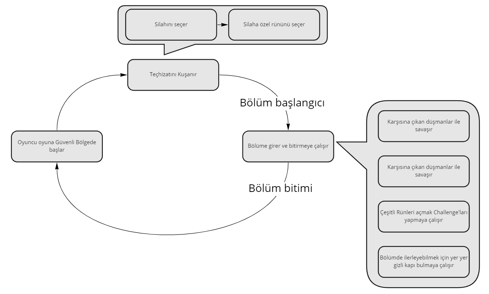

# X Game Documentation
&nbsp;&nbsp; Oyunumuz yıldırımların hükmettiği Post-Apocalyptic bir dünyada geçmektedir. Kahramanımız hayatta kalmak için silahını kuşanıp dışarıdaki tehlikelere karşı savaşmaktadır.

| Oyun | Hakkında |
|:-|-:|
|**Tema**| Yıldırım ve şimşekler|
|**Tür** | Aksiyon, Platform, Macera|
|**Hedef Platform** | PC|
|**Görsel Tarz**| Lowpoly|
|**Hedef Kitle**| PC oyunu oynaya herkes|
|**Geliştirme Süreci**| 1 - 10 Eylül|

## İçerik
1. [Haraket Mekanikleri](#haraket-mekanikleri)
	- [Keyboard](#keyboard)
	- [Controller](#controller)
2. [Core Game](#core-game)
3. [Hayatta Kalma](#hayatta-kalma)
4. [Savaş](#savaş-combat)
    - [Düşman Çeşitleri](#düşman-çeşitleri-enemy-styles)
        - [Askerler](#askerler)
        - [Böcek](#böcekler)
        - [Enerji formu](#enerji-formları)
    - [Savaş Mekanikleri](#savaş-mekanikleri-combat-mechanics)
        - [Saldırı](#1-saldırı)
        - [Savunma](#2-savunma)
        - [Kaçınma](#3-kaçınma)
    - [Silahlar](#silahlar)
        - [Silah Levelleri](#silah-levelleri)
        - [Kılıç](#kılıç)
        - [Mızrak](#mızrak)
        - [Kalkan](#kalkan)
        - [Yay](#yay)
5. [Yetenek Ağacı _(Yakında..)_]()
6. [kesin unuttuğum birşey vardır aq _(Yakında..)_ ]()

## Haraket Mekanikleri

### Keyboard

- ileri geri için A ve D
- Zıplamak için Space ve W
- Etkileşim tuşu E
- Saldırı ve savunma LMB, RMB
- Kaçınma Ctrl
### Controller

> _Tuşlar Xbox kumandası baz alınarak verilmiştir_
- İleri geri için LeftJoystick
- Zıplamak için A
- Etkileşim tuşu RightTrigger
- Saldırı ve savunma X, Y
- Kaçınma B

## Core Game

## Hayatta Kalma
&nbsp;&nbsp; Hayatta kalma mekanikleri can ve enerji baz alarak ilerliyor. Karakterin çoğu aksiyonu enerji harcar, eğer enerjisi biter ise karakter yorulur ve soluklanmak için bir müddet olduğu yerde kalır.

Karakterin canı: (100 + ((Kullandığı silahın seviyesi) * 30)), enerjisi: 150 dir. Oyuncu eğer enerji harcayan bir eylem gerçekleştirmez ise enerji saniyede 50 dolacak şekilde dolmaya başlar. Can kendi kendine dolmaz.

## Savaş _(Combat)_
&nbsp; &nbsp; Oyuncu bölüm başında silahını seçer ve maceraya başlar. Bu macerada karşısına belirli düşmanlar çıkacaktır, Düşmanla karşılaşıldığında ise;

### Düşman Çeşitleri _(Enemy Styles)_
&nbsp; &nbsp; Oyunda farklı yapıya sahip 3 düşman tipi var, bunlar; Askerler, Böcekler ve Enerji formları.
#### Askerler

&nbsp; &nbsp; Askerler klasik ve normal düşman tipidir, oyuncunun kullandığı silahları onlarda kullanır. Görüş alanına girdiğinizde sizi takip eder ve vuruş menziline girerseniz size saldırırlar. Kullandıkları silaha göre dayanılıkları, hızları ve hasarları değişkenlik gösterir.
Can Havuzu: Değişken _(sonra eklenecek)_ 
#### Böcekler

&nbsp; &nbsp; Böcekler yerden çıkar ve yaydıkları güçlü Aura ile aura menzilindeki düşmanları hasar almaz hale getirirler ama kendileri hasar alabilir. Çok dayanıklı değillerdir ama Hızlı haraket ederler. Can havuzu: 100.
#### Enerji Formları

&nbsp; &nbsp; Enerji formları saçtıkları elektik ile oyuncuyu çarpar ve bir süreliğine yavaşlatır. Hasarı azdır ama kendisi dayanıksız değildir çok fazla haraket kabiliyetleri de yoktur. Çarpılan oyuncunun haraketi ve saldırıları yavaşlar, çarpılma etkisinden kurtulana kadar defans duruşuna geçemez. Can havuzu: 150;

### Savaş Mekanikleri _(Combat Mechanics)_
&nbsp;&nbsp; Oyuncu savaş esnasında toplamda 3 Mekaniğe sahip, Bunlar Saldırı Savunma ve Kaçınma;
#### 1. Saldırı
&nbsp;&nbsp; Oyuncu farenin Sol tuşu ile saldırıya geçer. Saldırmaya karar verdiği anda bir miktar enerji harcar _(Eğer yeterli enerjisi yok ise saldıramaz)_ ardından saldırı animasyonu devreye girer. Saldırı gerçekleştiğinde silahın çeşitine göre menzilinde bir düşman var ise ilgili düşman hasar alır , Silahın etkileri üzerine uygulanır ve 0.1 saniye sersemler. Ard arda yapılan öldürmeler kombo olarak nitelendirilir ve her 5X comboda hasar (Kombo sayacı * 3x) kadar artar.
#### 2. Savunma
&nbsp;&nbsp; Oyuncu farenin sağ tuşu ile defans duruşuna geçer, sağ tuşu bıraktığında karakter defans duruşunu bırakır. Defans duruşu sırasında enerji emilim şeklinde azalır, enerji bitiminde defans duruşunu bırakır. Aynı zamanda defans duruşu sırasında vuruş alırsa ilgili savunan ve saldıran silah kombinasyonuna göre oyuncu; azaltılmış hasar alabilir, vuruşu engelleyebilir veya her şeye rağmen saldırıyı engelleyemeyebilir. Eğer parry aktifleşir ise toplam enerjisinin %5 kadarını anında geri kazanır.

Parry: Eğer hasar yemeden 0.3 saniye önce Defans duruşuna geçmiş ise ilgili saldıran/savunan silah kombinasyonuna göre parry yapabilir.
#### 3. Kaçınma
&nbsp;&nbsp; Oyuncu kaçınma animasyonunda iken hasar almaz ve saldırı yapamaz.

### Silahlar
&nbsp;&nbsp; Oyunda 3'ü yakın 1'i uzak mesafe olmak üzere toplamda 4 tane silah bulunmakta bunlar; kılıç, mızrak, kalkan ve yay'dır. Silahlar kullanıldıkça deneyim puanı kazanırlar ve bu puanlar ile seviye atlarlar, her 2 seviyede bir silahın görünümü bir üst düzeye geçer. Ayrıca her silahın challange ile açılan özelleştirilmiş rünleri vardır, bu rünlerden 1 tanesini silah seçerken aktif edilir ve bölüm ortasında değiştirilemez.

#### Silah Levelleri
 - Level 0-25, Seviye 0
 - level 25-50, Seviye 1 -> Görünüş güncellemesi
 - level 50-75, Seviye 2
 - level 75-100, Seviye 3 -> Görünüş güncellemesi
 - level 100-125, Seviye 4
 - level 125, 150, Seviye 5 -> Görünüş güncelemesi

#### Kılıç

- Saldırı anında menzilindeki bütün düşmanlara kesme şeklinde vurarak hasar uygular, kısa mesafede etkilidir. Hasar : (20 * seviye)
- Defans duruşunda iken uzak mesafeli saldırıları %10 ihtimalle savurur, Kalkan ve mızrak saldırılarını engelleyemez iken Kılıç saldırılarını %100 engeller.
- **Rünleri ise**;
	- **Tırtıklı Yüzey**: Yapılan her saldırı düşman üzerinde kanama efekti uygular. _(İlk bölümü bu silah ile bitirince unlock olur.)_ Hasar: Saniye başına 10 hasar. Etki 3 saniye sürer.
	- **Şifalı Vuruş**: Düşman öldürmek eksik canının %2'sini geri doldurur. _(Bu silah ile herhangi bir hasar almadan 10 düşman öldürünce unlock olur.)_
	- **Kesici Dalga**: Yapılan saldırılar ileri doğru bir dalga yollar ve dalgaya deyen herkes hasar alır. _(Bu silah ile tek vuruşta 3 kill alınca unlock olur.)_ Hasar: (10 * seviye)
	- **Seri katil**: 10x kombo yapınca hasar artışı sağlar. _(Bu silah ile 5 vuruşta toplam 5 kill alınca unlock olur.)_ hasar artışı: +%30

#### Mızrak

- Saldırı anında menzilindeki bütün düşmanlara delme şeklinde saldırarak hasar uygular, orta mesafede etkilidir. Kısa mesafede hasar vuramaz. Hasar : (25 * seviye)
- Default olarak %5 zırh deşmeye sahiptir _(Zırhlı düşmanlara %5 fazladan vurur)_
- Defans duruşunda iken kılıç saldırılarını %50 ihtimalle savurur. Kalkan, Yay ve Mızrak saldırılarını engelleyemez.
- **Rünleri ise**
	- **Zehir Diş**: Yapılan her saldırı düşman üzerinde zehir efekti uygular. _(İlk bölümü bu silah ile bitirince unlock olur.)_ Hasar: Saniye başına 10 hasar. Etki 3 saniye sürer.
 	- **Hızlı Vuruş**: Normal saldırılar 3'lü vuruş yapar. 3 vuruş birden vurma etkileri uygular. _(Bu silah ile tek saldırıda 3 kill alınca unlock olur.)_ Hasar: (hasar * 3)
	- **Kırık Zırh**: Zırh deşme oranı %20 artarak %25 olur. _(Bu silah ile ard arda 4 vuruşta 4 kill alınca açılır.)_
	- **İtici Vuruş**: Mızrağı yere vurup yakınındaki düşmaları saldırı menziline iter. _(Bu silah ile 2 sn içinde hem önünden hemde arkadan kill alınca unlock olur.)_

#### Kalkan

 - Saldırı anında menzilindeki düşmanlara itme şeklinde saldırarak hasar uygular ve düşmanları bir miktar itip 0.1sn sersemletir. Ağır saldırı yapar. Çok kısa mesafede hasar uygular. Hasar : (50 * seviye)
 - Defans duruşunda bütün silahlardan gelen saldırıları savuşturur, ve defans duruşunda %10 daha yavaş enerji tüketir.
 - **Rünleri ise**
 	 - **Dodge Master**: Parry halinde düşman 0.5sn sersemler. _(İlk bölümü bu silah ile bitirince unlock olur.)_
	 - **Hurraa**: Oyuncu hücuma kalkar ve önündeki bütün düşmanları durduğu yere kadar iter. _()_
	 - **Kapı Gibi**: Karşı yönden gelen bütün hasarı defans duruşuna gerek kalmadan engeller. _()_
	 - **Tokalaşma**: Hem önünde hem arkasında düşman var ise arkadaki düşmanı alıp önüne atar _()_

#### Yay

 - Saldırı halinde karakter bir ok atar ve rün çeşitine göre hasar verir. Rün yok ise ok dediği ilk düşmana saplanır ve hasar uygular. Yay'ın farklı gerginlikleri yoktur belirli, sadece ayarlanan mesafede gider. Hasar : (20 * seviye)
 - Defans duruşu yoktur. Ama hafifliğinden dolayı karakter yay kullanırken daha hızlıdır.
 - **Rünleri ise**
	 - **Çift Ok**: Saldırı esnasında aynı anda 2 ok atar. Hasar: 2x _(İlk bölümü bu silah ile bitirince unlock olur.)_
	 - **Yıldırım Oku**: Attığı okların ucu gümüştendir. Bu sayede çarptığı yüzeye yıldırım düşer. Yıldırım hasarı : 60.
	 - **Kaboom**: Attığı okların ucunda barut torbası bulunur. Bu sayede çarptığı yerde bir patlama oluşur. Patlama Hasarı: (40 * seviye).
	 - **Ateş Topları**: Attığı okların ucunda çakmaktaşı ve saman bulunur. Bu sayede çarptığı yer bir müddet yanar. Ates hasarı : saniye başına 10;
